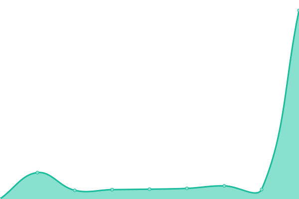

# [📈 Live Status](https://SimpleEdit.github.io/status): <!--live status--> **🟩 All systems operational**

This repository contains the open-source uptime monitor and status page for [SimpleEdit](https://simpleedit.github.io), powered by [Upptime](https://github.com/upptime/upptime).

<!--start: status pages-->
<!-- This summary is generated by Upptime (https://github.com/upptime/upptime) -->
<!-- Do not edit this manually, your changes will be overwritten -->
<!-- prettier-ignore -->
| URL | Status | History | Response Time | Uptime |
| --- | ------ | ------- | ------------- | ------ |
|  [Editor web app](https://editor.simpleedit.repl.co) | 🟩 Up | [editor-web-app.yml](https://github.com/SimpleEdit/status/commits/HEAD/history/editor-web-app.yml) | 

 156ms
     
 | 

<a href="https://SimpleEdit.github.io/status/history/editor-web-app">100.00%</a>
    

|  [Website](https://simpleedit.github.io) | 🟩 Up | [website.yml](https://github.com/SimpleEdit/status/commits/HEAD/history/website.yml) | 

 118ms
     
 | 

<a href="https://SimpleEdit.github.io/status/history/website">100.00%</a>
    

|  [Feedback portal](https://simpleedit.canny.io) | 🟩 Up | [feedback-portal.yml](https://github.com/SimpleEdit/status/commits/HEAD/history/feedback-portal.yml) | 

 232ms
     
 | 

<a href="https://SimpleEdit.github.io/status/history/feedback-portal">100.00%</a>
    

<!--end: status pages-->

[**Visit our status website →**](https://SimpleEdit.github.io/status)

## 📄 License

- Powered by: [Upptime](https://github.com/upptime/upptime)
- Code: [MIT](./LICENSE) © [SimpleEdit](https://simpleedit.github.io)
- Data in the `history` folder: [Open Database License](https://opendatacommons.org/licenses/odbl/1-0/)
